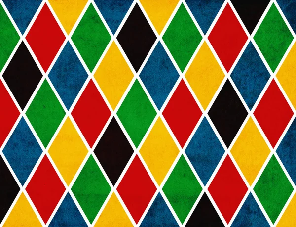
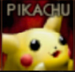

# Trabajo Práctico Nro. 2

## Consigna: 
Usando como base el programa brindado por la cátedra, crear un programa que permita seleccionar una
porción rectangular de una imagen con el ratón, luego:
- con la letra “g” lo guardamos a disco en una nueva imagen y salimos.
- con la letra “r” restauramos la imagen original y volvemos a realizar la selección.
- con la “q” salimos.

Para correr el programa colocar en la consola:
```sh
  python3 tp1.py
  ```

## Desarrollo

Se utilizará como imagen base la pantalla de selección del juego Super Smash Bros porque en la misma se presentan bordes definidos entre cada personaje, con lo que se podrá verificar si la selección, recorte y guardado son correctos o no.



Aquí debajo se observará la última selección realizada: 



https://docs.opencv.org/3.4/d4/d61/tutorial_warp_affine.html
https://pyimagesearch.com/2021/04/28/opencv-thresholding-cv2-threshold/
https://programmerclick.com/article/46211852755/